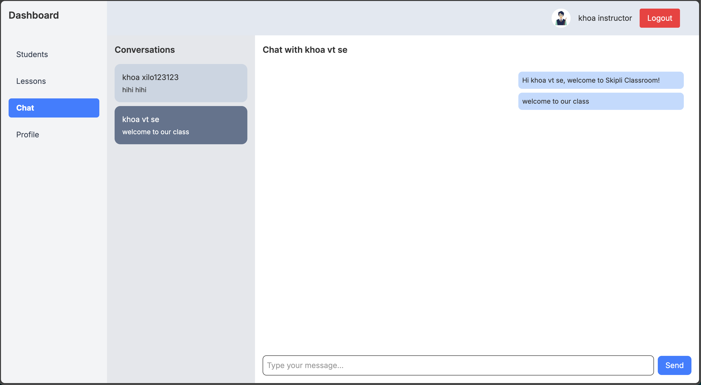

# 📚 Classroom App

A modern classroom management application built with **React (Vite + TypeScript)** and styled using **Tailwind CSS**. This app facilitates communication and lesson tracking between instructors and students, with secure authentication and real-time chat powered by **Socket.IO**.

---

## 🚀 Tech Stack

| Feature         | Technology                   |
| --------------- | ---------------------------- |
| Frontend        | React (Vite + TypeScript)    |
| Styling         | Tailwind CSS                 |
| Chat Service    | Socket.IO                    |
| Authentication  | Access Token + Refresh Token |
| Node.js Version | 22.16.0                      |

---

## 🔐 Authentication Flow

- The app uses **Access Token and Refresh Token** for secure authentication.
- Only **US phone numbers** are supported for instructor login.

---

## 🧑‍🏫 Instructor Flow

1. **Signup**

   - Provide name, email, and **US phone number**.

2. **Login**

   - Receive access code via phone and use it to log in.

3. **Student Management**

   - Add student using: name, email, phone, address.
   - A setup link is sent to the student's email.
   - View student list.
   - Edit student details (name and address).
   - Remove student from class.

4. **Lesson Management**

   - Assign lessons to students.
   - View assigned lessons.

5. **Chat**

   - One-on-one chat with each student using **Socket.IO**.

6. **Profile Management**
   - Update personal profile information.

---

## 🧑‍🎓 Student Flow

1. **Setup Account**

   - Use the setup link received via email to create an account.
   - Set username and password.

2. **Lesson Management**

   - View assigned lessons.
   - Update lesson statuses.

3. **Chat**

   - Chat one-on-one with the instructor.

4. **Profile Management**
   - Update personal profile information.

---

## 📦 Project Structure: Use src folder as parent

- apis: API definitions and service functions
- assets: Static assets (images, icons, etc.)
- axios: Axios configuration (base URL, interceptors)
- components: Reusable UI components
- layout: Shared layout components (headers, wrappers, etc.)
- pages: Application pages (guest and authenticated views)
- routes: Application route definitions
- sockets: Socket.IO configuration
- store: Global state management (via useContext)
- utils: Helper functions, constants, and TypeScript types

## 📄 Setup Instructions

### 1. Prerequisites

- Node.js v22.16.0
- npm

### 2. Install dependencies

- npm install

### 3. Add .env file

- Follow .env.example

### 4. Run the app: 2 options

- Run development mode: npm run dev
- Build and preview:
  - npm run build
  - npm run preview
